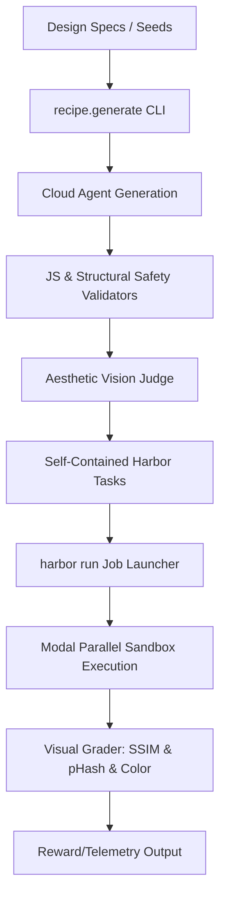

# 🌌 `web-design-bench`: Scalable RL Environments for Web Design Replication

[](https://harborframework.com/)
[](https://www.python.org/)
[-orange.svg?style=flat-square)](https://anthropic.com/)

> A highly scalable, production-grade Reinforcement Learning (RL) environment recipe and evaluation pipeline for benchmarking AI coding agents on high-fidelity, multi-page website replication.

---

## 📚 Documentation Navigation

Explore our comprehensive documentation suite covering architectural theory, empirical benchmark data, and visual verification proofs across all three evaluation tiers:

* **[🏆 Submission Summary & Team Presentation Guide](docs/submission_summary.md)**: Master presentation synthesis addressing all core evaluation parameters, work trial deliverables, exact `[0, 1]` dense CV grading math, and empirical architectural findings across **Parts 1, 2, and 3**.
* **[Evaluation Report & Model Behavior Ledger](docs/evaluation_report.md)**: Master quantitative evaluation report containing empirical numbers, `Pass@K` rates, submetric distributions, and model failure analysis across **Part 1 (Static `v1`)**, **Part 2 (Animation `v2`)**, and **Part 3 (Multi-Framework `v3`)**.
* **[Part 2: Animations & Temporal State Freezing](docs/part2_animations.md)**: Architectural specifications for non-lossy CSS animation verification via Playwright temporal freezing (`t0`, `t500`, `t1200`) and 3-second WebM video rendering.
* **[Part 3: Multi-Framework Architecture & SPA Verification](docs/part3_frameworks.md)**: Engineering deep-dive into our 2×2 framework evaluation matrix (`React JS` vs. `Solid JS`, `Vanilla CSS` vs. `Tailwind CSS`), Vite compilation checks, and automated in-memory navigation (`#nav-<tab_id>`).
* **[Visual Grader Validation Reports](docs/grader_validation/grader_validation.md)**: Side-by-side comparative visual proof across Parts 1, 2, and 3 (`best` vs. `worst` agent trials vs. reference designs), demonstrating that higher continuous computer vision scores objectively equal higher design quality.
* **[Design Decisions & Trade-offs](docs/design_decisions.md)**: Underlying architectural rationale covering our continuous visual grader over brittle tree-diffing, containerized safety policies (`No-JS`), and aesthetic synthesis judges.

---

## 🚀 Executive Summary & Architecture

This repository hosts a robust **RL Environment Recipe** built on top of the **Harbor Framework** to assess state-of-the-art coding agents (e.g., Claude Code with Opus 4.7) on their ability to translate design requirements and screenshots into production-quality front-end code.

Rather than relying on brittle HTML tree-diffing or exact text matching, the framework implements a **multivariate Computer Vision (CV) visual grading pipeline** utilizing Structural Similarity Indexing (SSIM), Perceptual Hashing (pHash), and Color Histogram Correlation to score rendered implementations against ground-truth designs on a continuous `[0, 1]` scale.



---

## 🛠️ Key Capabilities & Features

### 📐 Pixel-Perfect Multi-Page Grader
* **High-Fidelity Synthesis**: Programmatically seeds and generates realistic, human-like multi-page websites across 10 diverse archetypes (AI Startup, Luxury Fashion, Crypto Exchange, Architecture Studio, etc.) with at least 5 pages each.
* **Continuous Visual Grading**: Computes a balanced score combining structural patterns (SSIM, 50% weight), macro visual gestalt (pHash, 30% weight), and color palette distribution (Color Histogram, 20% weight).
* **Multi-Viewport & Responsive Benchmarking**: Renders and grades layouts independently across desktop (`1280x800`) viewports with natural scroll height capture.

### 📦 Production Framework Scaffolding
* **Harbor Schema v1.1**: Evaluates modern development workflows by packaging fully configured compile-time pipelines inside Docker containers.
* **No-JS Policy Enforcement**: Strict validators ensure agents are evaluated purely on HTML/CSS design replication rather than JavaScript event hacks or scripts.

---

## 📂 Repository Directory Layout

```markdown
/
├── run_eval.sh                 # Central orchestration shell runner script
├── pyproject.toml              # Project dependencies, python specifications & linter settings
├── README.md                   # Project landing page and main user manual
├── tasks/                      # Registered, self-contained Harbor task packages
│   └── v1-aistartupneon...     # Configured task environment (instruction, assets, verifier tests)
├── recipe/                     # Automated task generation pipeline codebase
│   ├── generate.py             # Main CLI entrance for at-scale task synthesis
│   ├── configs/                # Website archetype definitions (18 configs across 3 parts)
│   ├── validators/             # Safety & structure checks (javascript, structure, complexity)
│   ├── spec.py                 # DesignSpec builder
│   ├── prompt.py               # Agent prompt renderer
│   ├── agent.py                # Claude API caller for website generation
│   ├── capture.py              # Playwright screenshot capture
│   └── packager.py             # Assemble into Harbor task directory
├── grader/                     # Shared grading logic (copied into tasks/tests/)
│   ├── grade.py                # Visual similarity scorer (SSIM + pHash + Color Histogram)
│   ├── render.py               # Playwright screenshot renderer
│   └── text_recall.py          # Token-level content recall
├── eval/                       # Evaluation orchestration & post-processing
│   ├── run.py                  # CLI orchestrator to launch harbor runs
│   ├── summarize.py            # Auto-generates summary.json & updates evaluation_report.md
│   ├── visualize.py            # Static chart generation (box plots, bar charts)
│   ├── grader_validation.py    # Side-by-side best/worst trial comparisons
│   ├── grading_analysis.py     # Metric correlation & sensitivity analysis
│   └── configs/                # Version-controlled job configuration suites
├── jobs/                       # Evaluation output directory (trajectories, logs, rewards)
├── results/                    # Per-job summaries, plots, and historical tracking
│   ├── history.csv             # Append-only CSV tracking all evaluation runs
│   └── <job-id>/               # Per-job summary.json & generated plots
└── docs/                       # Structured documentation and research reports
    ├── design_decisions.md     # Thought process & trade-offs (9 sections)
    ├── evaluation_report.md    # Results, analysis, model failure patterns
    ├── part2_animations.md     # Part 2 architecture: temporal state freezing & WebM generation
    ├── part3_frameworks.md     # Part 3 architecture: 2×2 framework matrix (React/Solid, Vanilla/Tailwind)
    └── grader_validation/      # Visual proof that higher reward = better design
```

---

## 🚀 Quick-Start & Evaluation Guide

Ensure you have [uv](https://astral.sh/uv/) installed. Install Harbor and Modal for evaluation:
```bash
uv tool install harbor
uv tool install modal && modal setup
```

### 1. Set Up API Credentials
The evaluation agents require your Anthropic API key to interact with Claude Opus 4.7. Store it in your environment:
```bash
export ANTHROPIC_API_KEY="sk-ant-..."
```

### 2. Launch Evaluations via JobConfig
The framework utilizes the central shell wrapper to trigger mass-parallel evaluations on Modal (100 trials concurrently):

```bash
# Run evaluations via Modal (recommended, no Docker needed)
HARBOR_ENV=modal ./run_eval.sh --config v0_generated

# Or run locally with Docker (4 concurrent trials)
./run_eval.sh --config v0_generated
```

### 3. Browse Visual Trajectories & Scores
Launch the native web interface to inspect interactive trajectories, DOM differences, and rendering side-by-sides:
```bash
harbor view jobs/
```
Once running, open your web browser to [http://localhost:8080/](http://localhost:8080/) to browse visual reports of completed trials.

---

## 🛠️ Automated Task Generation Recipe CLI

Synthesize brand new, safety-validated tasks of custom visual styles and difficulty tiers at scale using the generation CLI:

```bash
# List all available archetype configs (18 total: 10 Static v1, 4 Animation v2, 4 Framework v3)
uv run python -m recipe.generate --list

# Generate a single AI Startup task (Seed 42)
uv run python -m recipe.generate --config ai_startup_neon_hard --seed 42
```

### 🎛️ Difficulty Tiers & Config Library
The benchmark includes 18 distinct archetype configurations in `recipe/configs/library.py`, categorized into clear difficulty tiers based on design and layout complexity.

> [!NOTE]
> **Tiers reflect structural complexity, not empirical agent performance.** These difficulty labels (`easy`, `medium`, `hard`) categorize the density, advanced CSS styling, and animation choreography required by the design specification. They do not imply that agents will achieve higher rewards on "easy" tasks; state-of-the-art agents often excel at dense, structured layouts while struggling with specific subtle alignment or temporal constraints regardless of the nominal tier.

#### Part 1: Static Tasks (v1)
* **Easy**: Clean, standard layouts (e.g., single column, basic grids), standard typography, minimal decorative elements or complex background meshes.
  * `law_firm_corporate_easy`, `wellness_spa_organic_easy`
* **Medium**: Richer layouts (asymmetrical sections, overlapping cards), curated color palettes, custom UI components (pricing tables, calculators).
  * `luxury_fashion_serif_medium`, `food_delivery_playful_medium`, `indie_game_retro_medium`, `music_streaming_gradient_medium`, `travel_agency_tropical_medium`
* **Hard**: Dense, highly complex interfaces (e.g., SaaS dashboards, crypto exchanges), advanced CSS styling (glassmorphism, neon glows, complex gradient meshes).
  * `ai_startup_neon_hard`, `crypto_exchange_cyberpunk_hard`, `architecture_studio_mono_hard`

#### Part 2: Animation Tasks (v2)
* **Medium**: Clean, elegant animations (fade-ins, slide-ups) with moderate stagger delays (0.1s–0.5s). Tests basic temporal property adherence.
  * `portfolio_animation_medium`, `agency_animation_medium`
* **Hard**: Multi-phase keyframes (e.g., fade → slide → glow/pulse) and complex choreography with large stagger delays (0.5s–1.5s+), requiring precise intermediate state matching across extended time windows (0–1800ms).
  * `saas_animation_hard`, `fintech_animation_hard`

#### Part 3: Framework Tasks (v3)
* **React JS + Vanilla CSS**: Single Page Application (SPA) using Vite and Vanilla CSS custom properties.
  * `react_css_easy`
* **React JS + Tailwind CSS**: SPA using Vite and Tailwind CSS utility classes.
  * `react_tailwind_medium`
* **Solid JS + Vanilla CSS**: SPA using Vite, Solid signals, and Vanilla CSS.
  * `solid_css_medium`
* **Solid JS + Tailwind CSS**: SPA using Vite, Solid signals, and Tailwind CSS (`class` attribute convention).
  * `solid_tailwind_hard`

---


## 📊 Grader Core Mechanics (Visual Similarity & Text Recall)

The evaluation framework combines visual fidelity (CV-based layout matching) with content correctness (semantic token-based matching):

### 1. Visual Similarity Grader (`reward`)
The visual score enforces visual alignment across three complementary metrics:

```
Visual Reward (Page) = (0.50 * SSIM_Cropped) + (0.30 * pHash_Score) + (0.20 * Color_Histogram_Correlation)

where pHash_Score = 1.0 - (pHash_Distance / 64.0)
```

* **SSIM (50% weight)**: Highly sensitive to spacing shifts, typography changes, layout grids, alignment breaks, and overflowing boundaries.
* **pHash (30% weight)**: Captures visual gestalt (structural placement of headers, buttons, colors, and balance) regardless of minor sub-pixel rendering deltas.
* **Color Histogram (20% weight)**: Compares 3D HSV color distributions using Pearson correlation. Catches severe color palette mismatches (e.g., agent generating a light theme instead of a dark theme) that SSIM and pHash often underweight.
* **Height Penalty**: Applies a quadratic penalty when the height ratio drops below 0.5, heavily penalizing truncated sections or omitted widgets.

### 2. Text Recall Content Grader (`mean_text_recall`)
To catch instances where agents output visually perfect layouts but utilize Lorem Ipsum placeholder texts or omit critical textual information, we integrate a semantic token recall check. For each page:

```
Text Recall (Page) = |GroundTruth_Tokens intersect Agent_Tokens| / |GroundTruth_Tokens|
```

* **Token Filtering**: Raw HTML text is extracted, normalized, stripped of markup tags, and filtered to remove common stopwords and standard Lorem Ipsum sequences.

### 3. Holistic Blended Reward (`blended_reward`)
To guide RL agent alignment across both design and content requirements, we blend the visual and text recall scores:

```
Blended Reward = (0.75 * Visual Reward) + (0.25 * Mean Text Recall)
```
