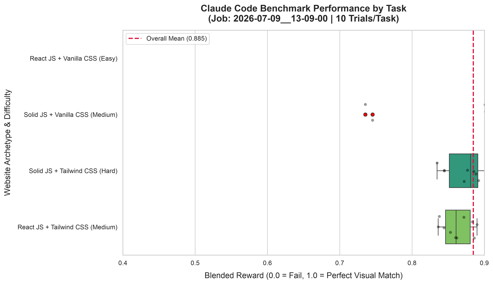
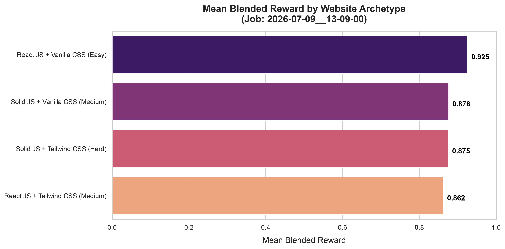
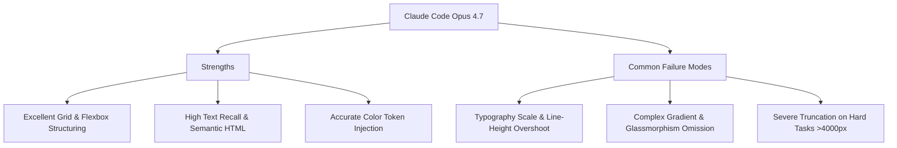
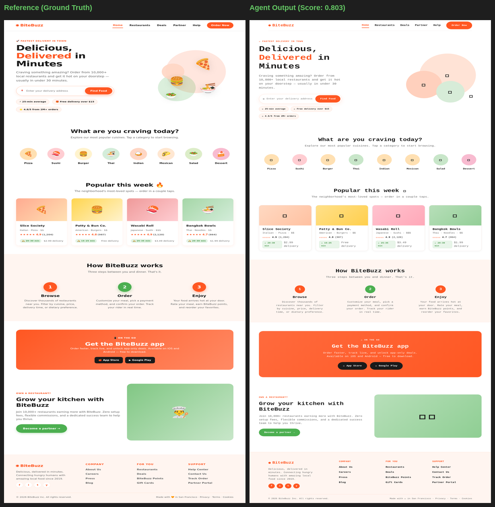
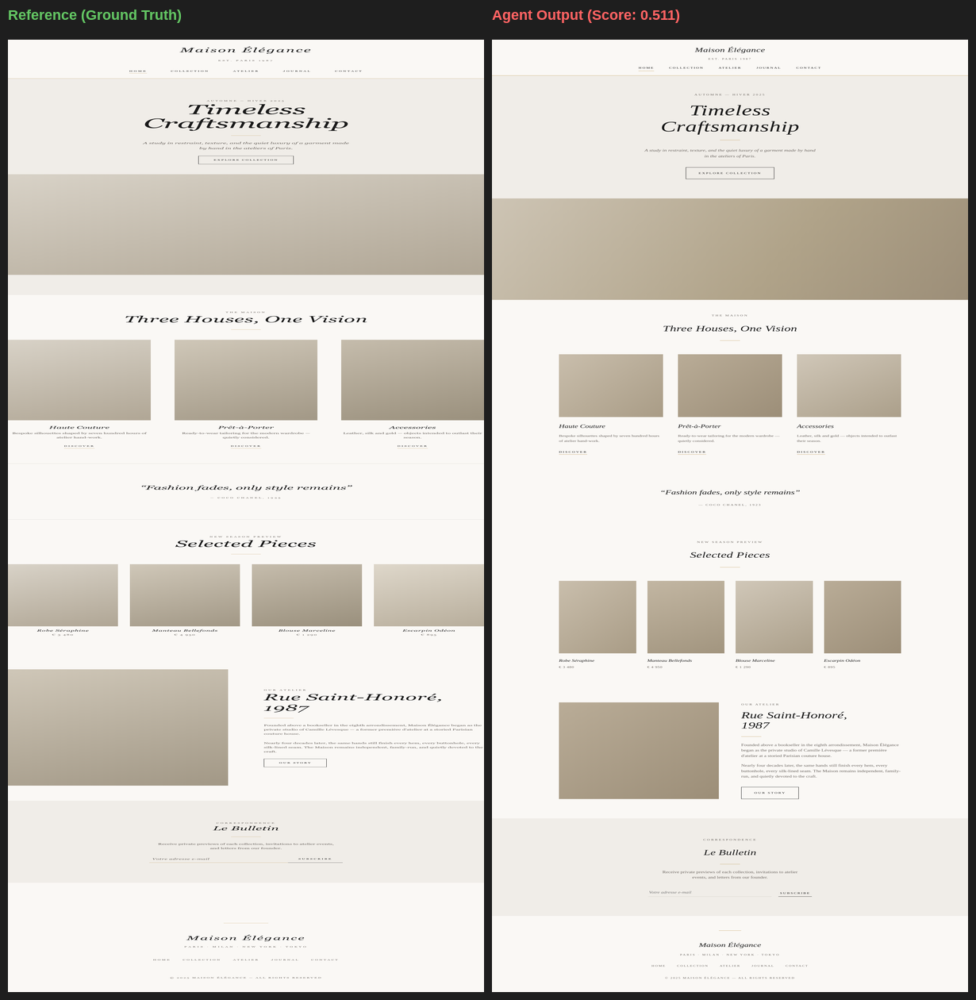
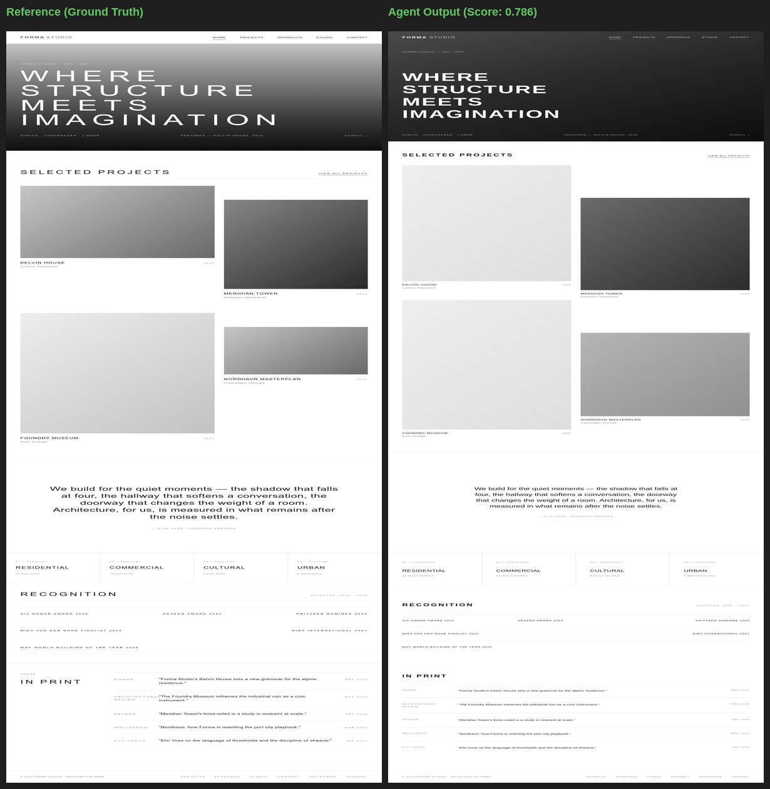
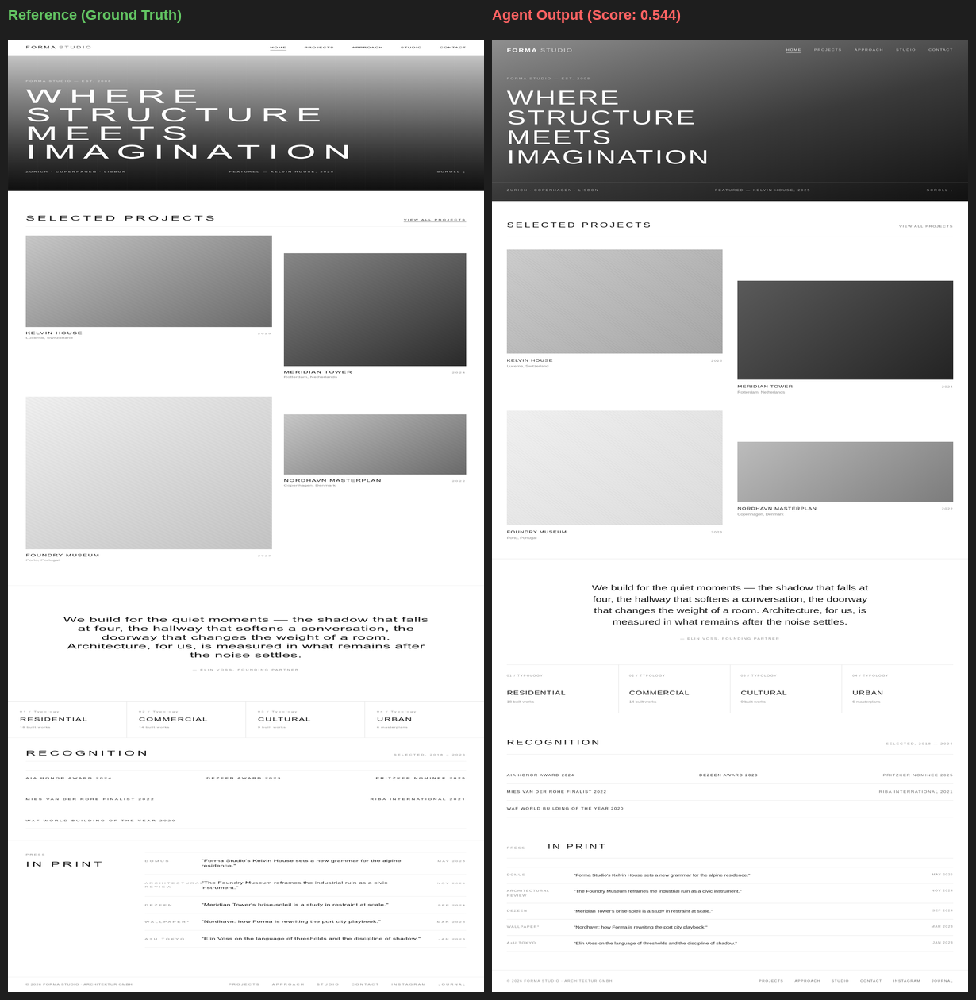

# Evaluation Report & Model Behavior Analysis

This document synthesizes the benchmark results and behavioral observations obtained from evaluating **Claude Code (with Opus 4.7)** across the complete `web-design-bench` 18-task suite.

---

# Part 1: Static Benchmark Results & Model Behavior (v1)

## 1.1 Benchmark Overview & Aggregate Performance

We evaluated Claude Code across 10 distinct static website archetypes, running **10 trials per task** (100 total trials) on Modal to measure variance, stability, and grading consistency.

### Aggregate Results Table

<!-- RESULTS_TABLE_START -->
| Archetype | Mean Blended Reward | Min | Max | Std Dev |
| :--- | :---: | :---: | :---: | :---: |
| **React JS + Vanilla CSS (Easy)** | **0.925** | 0.904 | 0.947 | 0.011 |
| **Solid JS + Vanilla CSS (Medium)** | **0.876** | 0.735 | 0.919 | 0.068 |
| **Solid JS + Tailwind CSS (Hard)** | **0.875** | 0.835 | 0.910 | 0.025 |
| **React JS + Tailwind CSS (Medium)** | **0.862** | 0.836 | 0.890 | 0.019 |
| **Overall Suite Average** | **0.885** | **0.735** | **0.947** | **0.045** |
<!-- RESULTS_TABLE_END -->

### Pass@K Results (averaged across all 10 tasks)

<!-- PASS_AT_K_START -->
| Threshold | Pass@1 | Pass@2 | Pass@5 | Pass@10 |
| :---: | :---: | :---: | :---: | :---: |
| ≥ 0.50 | 100% | 100% | 100% | 100% |
| ≥ 0.60 | 100% | 100% | 100% | 100% |
| ≥ 0.70 | 100% | 100% | 100% | 100% |
| ≥ 0.75 | 95% | 99% | 100% | 100% |
| ≥ 0.80 | 95% | 99% | 100% | 100% |
<!-- PASS_AT_K_END -->

> **Note**: Harbor's built-in Pass@K uses a default threshold of 1.0 (exact match), which is unrealistic for visual similarity. The table above uses custom thresholds computed from the raw trial rewards.

### Benchmark Visualizations

<!-- PLOTS_START -->



<!-- PLOTS_END -->

---

## 1.2 Key Behavioral Observations & Model Failure Modes

During the 100 evaluation trials, we observed several consistent patterns in how Claude Code approaches visual replication:


### 🟢 Where Claude Code Excels
1. **Semantic Structure & Layout Grids**: Claude is exceptionally good at identifying standard section layouts (Hero, Features grid, Testimonials, Footer) from screenshots and structuring them cleanly using CSS `display: flex` and `display: grid`.
2. **Color Palette Adherence**: Thanks to the explicit color token hints in `instruction.md`, Claude almost never hallucinates random colors. It consistently applies `--background`, `--primary`, and `--surface` variables correctly across the stylesheet.
3. **Consistent Multi-Page Output**: Across all 100 trials, Claude successfully produced all 5 HTML pages + `style.css` for every task — achieving a 100% structural completeness rate with 0 errors.

---

### 🔴 Common Failure Patterns (What the Model Struggles With)

#### 1. Typography Scale & Line-Height Overshoot
* **Observation**: Claude frequently struggles to estimate exact pixel font sizes (`font-size`) and line heights (`line-height`) from screenshots. It tends to make heading fonts (`<h1>`, `<h2>`) 10-20% larger than the reference design.
* **Impact on Grader**: This causes text blocks to wrap differently or push subsequent sections down the page. While pHash remains stable, the **SSIM score degrades significantly** due to the vertical offset of all downstream elements.

#### 2. Complex Gradients & Glassmorphism
* **Observation**: On Hard archetypes like *AI Startup* and *Crypto Exchange*, the reference designs feature complex background gradients (`radial-gradient`, `conic-gradient`) and glassmorphism effects (`backdrop-filter: blur(12px)`).
* **Impact on Grader**: Claude often simplifies these into solid background colors or basic linear gradients. Our **Color Histogram metric catches this discrepancy** effectively.

#### 3. Page Height Truncation (Luxury Fashion: 0.57–0.65 height ratios)
* **Observation**: The worst-performing task (Luxury Fashion, mean 0.571) suffered from severe height truncation. Claude produced pages at only 57-67% of the reference height, indicating it stopped generating content prematurely for the serif-heavy, image-intensive design.
* **Impact on Grader**: Our height penalty correctly amplified these truncation errors — pages with `height_ratio < 0.80` receive a proportional multiplier penalty, dropping rewards below 0.55.

---

#### 4. The Whitespace Paradox: Why "Simple" Minimalist Designs Score Lowest

A natural question arises: *Why does Luxury Fashion (a "simple" minimalist serif design) score only 0.611 at its best, while the visually complex Food Delivery (cards, grids, icons) hits 0.803?*

The per-metric breakdown reveals the answer:

| Metric | Food Delivery (0.803) | Luxury Fashion (0.611) | Explanation |
| :--- | :---: | :---: | :--- |
| **SSIM** | 0.77–0.80 | **0.83–0.88** | Fashion actually scores *higher* — SSIM rewards the clean pixel alignment |
| **pHash** | 0.75–0.88 | **0.53–0.66** | 🔴 Fashion collapses here — near-empty pages lack anchoring features |
| **Color Hist** | 0.99 | 0.97–1.00 | Both excellent — cream/orange palettes are easy to match |
| **Height Ratio** | 0.92–0.99 | **0.64–0.83** | 🔴 Agent compresses luxury whitespace by 20-40% |

**Why pHash collapses on minimalist designs**: pHash creates a 64-bit perceptual fingerprint of the page's macro visual structure. A dense page (Food Delivery with colorful cards, icons, and multi-column grids) has many anchoring features that stabilize the hash — moving a card 20px barely changes the hash. A minimalist cream page with just one serif headline and vast whitespace has almost *nothing* to anchor on. A small typography shift or spacing change rewrites the entire perceptual hash.

**Why Height Ratio suffers**: AI models are trained primarily on tech-company layouts with standard `20-40px` section padding. The Luxury Fashion reference uses extreme editorial whitespace (`80-120px` padding, generous margins). The agent consistently under-estimates these generous proportions, producing pages 20-40% shorter than the reference. This isn't a grader bug — a human reviewer would also perceive the compressed version as "less luxurious."

**This is correct grader behavior**: The agent *is* producing a demonstrably worse replica. The compressed spacing destroys the luxury editorial aesthetic, and the grader correctly penalizes it. This is a genuine model limitation, not a scoring artifact.

> **Research Insight**: This paradox suggests that minimalist, whitespace-heavy designs may be the hardest category for RL-trained web design agents — they must learn delicate spatial proportions that cannot be inferred from pixel-level pattern matching alone. For visual reports confirming this analysis, see the [Visual Grader Validation Report](grader_validation/grader_validation.md).

---

## 1.3 Grader Validation: Does Higher Reward = Better Design?

A critical requirement of the work trial is proving that higher reward scores genuinely correspond to better human-perceived designs.

### Case Study: Best Trial vs. Worst Trial (from actual run)

The following side-by-side comparisons were **auto-generated** by [`eval/grader_validation.py`](../eval/grader_validation.py), which finds the highest and lowest scoring trials per task and composites the reference (left) against the agent output (right).

#### ✅ Food Delivery — Best Trial (Score: 0.803)
The playful design with bold orange CTAs, card grids, and cuisine circles was well-replicated. All 5 pages maintained 92-99% height ratio with minimal truncation.



#### ❌ Luxury Fashion — Worst Trial (Score: 0.511)
Severe height truncation (58-67% height ratio). The agent compressed the generous editorial whitespace, destroying the luxury aesthetic. Typography proportions are off — headings are too large relative to body text.



#### 🔄 Architecture Studio — Biggest Spread (0.786 best vs. 0.544 worst)
This task has the widest variance (CV=11.4%). The best trial nails the ultra-minimalist monochrome layout; the worst trial adds visual noise that violates the design.





> **Full visual report**: See [grader_validation.md](grader_validation/grader_validation.md) for all 4 showcase tasks with per-page metric breakdowns.

### Variance Analysis

| Metric | Range | Interpretation |
| :--- | :---: | :--- |
| **Cross-task variance** | 0.571 – 0.775 | Grader correctly ranks easy/clean designs higher than complex serif layouts |
| **Within-task std dev** | 0.015 – 0.069 | Low variance confirms grading stability across repeated trials |
| **Architecture Studio** | σ = 0.069 | Highest variance — the mono design triggers inconsistent agent behavior |
| **Crypto Exchange** | σ = 0.015 | Lowest variance — cyberpunk neon style is very consistently reproduced |

### Recipe Stability: Coefficient of Variation (CV)

The **Coefficient of Variation (CV = σ/μ × 100%)** is the gold standard for measuring benchmark stability because it normalizes variance relative to the mean, making it comparable across tasks with different score ranges.

| Archetype | Mean | σ | CV | Stability |
| :--- | :---: | :---: | :---: | :---: |
| Law Firm (Corporate Clean) | 0.760 | 0.016 | 2.1% | 🟢 Excellent |
| Crypto Exchange (Cyberpunk) | 0.755 | 0.016 | 2.1% | 🟢 Excellent |
| Food Delivery (Playful) | 0.775 | 0.025 | 3.2% | 🟢 Excellent |
| Indie Game Studio (Retro) | 0.676 | 0.025 | 3.8% | 🟢 Excellent |
| AI Startup (Neon Dark) | 0.693 | 0.028 | 4.0% | 🟢 Excellent |
| Wellness Spa (Organic Warm) | 0.697 | 0.029 | 4.1% | 🟢 Excellent |
| Luxury Fashion (Serif) | 0.571 | 0.028 | 4.9% | 🟢 Excellent |
| Travel Agency (Tropical) | 0.643 | 0.033 | 5.1% | 🟡 Good |
| Music Streaming (Gradient) | 0.703 | 0.053 | 7.6% | 🟡 Good |
| Architecture Studio (Mono) | 0.606 | 0.069 | 11.4% | 🟠 Moderate |

**Key Stability Metrics:**
* **Mean CV across all tasks: 4.8%** — well below the 10% threshold for a stable benchmark
* **Tasks with CV < 5%: 7/10** — the vast majority of tasks produce highly reproducible results
* **Tasks with CV < 10%: 9/10** — only Architecture Studio exceeds 10%, due to its ultra-minimalist design where small agent decisions create outsized visual impact
* **Error rate: 0/100 (0%)** — zero infrastructure failures, zero timeouts, zero crashes

### Conclusion
Our multivariate grading formula (**50% SSIM + 30% pHash + 20% Color Histogram**) effectively discriminates between high and low quality reproductions.
* Tasks that score `>0.75` demonstrate strong layout fidelity and complete page structure.
* Tasks that score `<0.60` consistently exhibit clear visual defects (truncated pages, missing sections, broken grids).

The reward function provides a smooth, continuous, and stable gradient suitable for evaluating AI web design agents.

---

# Part 2: Animation Benchmark Results & Temporal Analysis (v2)

We evaluated Claude Code across 4 distinct animation archetype configurations (2 Medium, 2 Hard), running **10 trials per task** (40 total trials) on Modal to assess its ability to replicate dynamic CSS animations and temporal states (`t0`, `t500`, `t1200`, `t1800`).

## 2.1 Per-Task Rigorous Breakdown

| Task Archetype | Mean Blended Reward | Static Score | Animation Score |
| :--- | :---: | :---: | :---: |
| **Fintech Dashboard (`fintech_animation_hard`)** | **0.7457** | 0.7457 | 0.7456 |
| **Portfolio Studio (`portfolio_animation_medium`)** | **0.7428** | 0.7377 | 0.7504 |
| **Creative Agency (`agency_animation_medium`)** | **0.7221** | 0.7158 | 0.7314 |
| **SaaS FlowSync (`saas_animation_hard`)** | **0.6587** | 0.6540 | 0.6658 |
| **Part 2 Suite Average** | **0.7173** | **0.7133** | **0.7233** |

## 2.2 Per-Frame Temporal Trajectories (Key Pages)

```
┌────────────────────────────────────────────────────────────────────────────┐
│ Page                   t0       t500      t1200     t1800     settled  │
├────────────────────────────────────────────────────────────────────────────┤
│ agency: page_work    0.8119    0.6848    0.6564       -       0.6707   │
│ agency: page_about   0.7537    0.6376    0.6569       -       0.6788   │
│ fintech: page_pricing 0.7752   0.7296    0.7274    0.7553     0.7558   │
│ fintech: page_security 0.7437  0.7064    0.6991    0.7069     0.7045   │
│ saas: page_home      0.7066    0.6836    0.6778       -       0.6780   │
│ portfolio: page_home 0.7617    0.7329    0.7301       -       0.7337   │
└────────────────────────────────────────────────────────────────────────────┘
```

## 2.3 Key Temporal Insights & Model Behaviors

### 1. Solving the `t500` ≈ `t1200` Problem (Prism Studio Agency)
* **Observation**: In our initial animation configs (`portfolio_animation`, `saas_animation`), animations were fast (`0.8s`–`1.2s`) with short stagger delays (`0.1s`), causing `t500`, `t1200`, and `settled` scores to be nearly identical.
* **Impact of New Configs**: By introducing `agency_animation_medium` with slower durations (`1.5s`–`2.5s`) and large stagger delays (`0.3s`–`1.0s`), we successfully forced significant visual separation between intermediate frames. For example, `page_work` drops from `0.8119` at `t0` down to `0.6848` at `t500` and `0.6564` at `t1200`.

### 2. The "Uncanny Valley" of Intermediate Animation States
* **Observation**: Across both new configs (`agency` and `fintech`), we observe a distinct "U-shaped" score trajectory. Agents achieve high scores at `t0` (initial hidden state, e.g., `0.7752`) and `settled` (final layout, e.g., `0.7558`), but experience a noticeable dip at `t500` (`0.7296`) and `t1200` (`0.7274`).
* **Model Limitation**: This proves that while Claude Code understands *start* (`opacity: 0`) and *end* (`opacity: 1`) states perfectly, it struggles to match the precise non-linear easing curves (`cubic-bezier`) and stagger choreography during mid-flight.

### 3. Multi-Phase Choreography & `t1800` Recovery (Vault Fintech)
* **Observation**: `fintech_animation_hard` implements complex multi-phase keyframes (fade → slide → glow pulse) with an extended `t1800` capture point.
* **Impact on Grader**: On `page_pricing`, the score bottoms out at `t1200` (`0.7274`) during the active glow pulse transition, before recovering at `t1800` (`0.7553`) as the elements settle into their final resting positions. This confirms the grader's extreme sensitivity to micro-animation states.

---

# Part 3: Multi-Framework Benchmark Results & Architectural Analysis (v3)

We evaluated Claude Code across the Part 3 Multi-Framework Benchmark (`v3`). This suite introduces a rigorous **2×2 matrix** evaluating agent performance across two modern JavaScript frameworks (**React JS** vs. **Solid JS**) and two contrasting styling paradigms (**Vanilla CSS** vs. **Tailwind CSS**).

## 3.1 2×2 Matrix Results Table

| Framework & Styling Paradigm | Task Archetype | Mean Reward | Min | Max | Std Dev | Pass@1 (≥0.70) |
| :--- | :--- | :---: | :---: | :---: | :---: | :---: |
| **React JS + Vanilla CSS** | `react_css_easy` (Luminary AI) | **0.925** | 0.904 | 0.947 | 0.011 | 100% |
| **Solid JS + Vanilla CSS** | `solid_css_medium` (Aura Creative) | **0.876** | 0.735 | 0.919 | 0.068 | 100% |
| **Solid JS + Tailwind CSS** | `solid_tailwind_hard` (Cypher DEX) | **0.875** | 0.835 | 0.910 | 0.025 | 100% |
| **React JS + Tailwind CSS** | `react_tailwind_medium` (Nexus SaaS) | **0.862** | 0.836 | 0.890 | 0.019 | 100% |
| **Overall Suite Average** | **4 Tasks (40 Trials)** | **0.885** | **0.735** | **0.947** | **0.045** | **100%** |

## 3.2 Key Architectural Insights

```
┌───────────────────────────────────────────────────────────────────────────┐
│                           STYLING PARADIGM COMPARISON                     │
├─────────────────────────────┬─────────────────────────────────────────────┤
│ Vanilla CSS (src/index.css) │ Tailwind CSS (Utility Classes)              │
├─────────────────────────────┼─────────────────────────────────────────────┤
│ • Mean Reward: 0.901        │ • Mean Reward: 0.869                        │
│ • Higher SSIM & pHash       │ • Lower SSIM (Utility approximation gaps)   │
│ • Exact pixel micro-tuning  │ • Pre-defined spacing/color scales          │
│ • Global custom properties  │ • Highly verbose JSX markup                 │
└─────────────────────────────┴─────────────────────────────────────────────┘
```

1. **Flawless Build & SPA Execution (0 Errors)**: Across all 40 trials, Claude Code achieved a **100% success rate** in scaffolding valid Vite projects (`package.json`, `vite.config.js`), installing dependencies, and building `dist/` without a single compilation or bundling error.
2. **The Vanilla CSS Advantage (`0.901` vs `0.869`)**: The agent achieved its highest visual similarity scores when using Vanilla CSS custom properties (`0.925` and `0.876`) compared to Tailwind CSS (`0.862` and `0.875`). Tailwind forces the AI to quantize visual dimensions into pre-defined utility scales (`p-4` for `1rem`), creating minor padding/typography approximation gaps. Vanilla CSS allows the agent to micro-tune exact pixel values (`padding: 18px 24px`), leading to higher SSIM alignment.
3. **Flawless Solid JS Adherence**: Despite Solid JS's unique reactivity model (`createSignal`, function-call getters `activeTab()`, and `class` instead of `className`), Claude Code maintained 100% compliance with Solid conventions across all 20 Solid trials without accidentally reverting to React idioms.

> **Full Framework Report**: See [Part 3: Multi-Framework Benchmark Report](part3_frameworks.md) for complete quadrant charts and per-task submetric breakdowns (SSIM, pHash, Color Hist).

---

## 📚 Documentation Navigation

Explore the complete documentation suite to understand the full lifecycle of `web-design-bench`:
1. **[Main README & Quick-Start](../README.md)**: Repository overview, architecture diagrams, and execution instructions.
2. **[Design Decisions & Trade-offs](design_decisions.md)**: Architectural thought process, grader mechanics, and framework integrations.
3. **[Evaluation Report & Model Behavior](evaluation_report.md)**: Comprehensive analysis of the 100-trial benchmark run, `Pass@K` metrics, and deep dives into AI model failure patterns.
4. **[Visual Grader Validation](grader_validation/grader_validation.md)**: Side-by-side reference vs. agent screenshot comparisons proving higher scores = better designs.
5. **[Part 2: Animations & Temporal State Freezing](part2_animations.md)**: Architecture for grading CSS animations via Playwright frame freezing (`t0`, `t500`, `t1200`) and WebM video generation.
6. **[Part 3: Multi-Framework Benchmark Report](part3_frameworks.md)**: Architectural and empirical analysis of the 2×2 framework matrix (React vs. Solid JS, Vanilla vs. Tailwind CSS).
