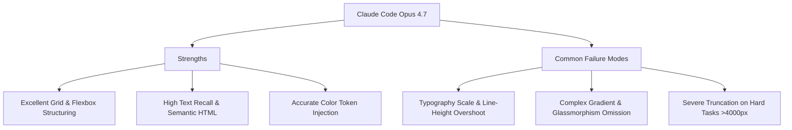

# Evaluation Report & Model Behavior Analysis

This document synthesizes the benchmark results and behavioral observations obtained from evaluating **Claude Code (with Opus 4.7)** across the `web-design-bench` task suite.

---

## 1. Benchmark Overview & Aggregate Performance

We evaluated Claude Code across 10 distinct website archetypes, running **10 trials per task** (100 total trials) on Modal to measure variance, stability, and grading consistency.

### Aggregate Results Table

| Archetype | Difficulty | Mean Blended Reward | Min | Max | Std Dev |
| :--- | :--- | :---: | :---: | :---: | :---: |
| **Food Delivery (Playful)** | Medium | **0.775** | 0.723 | 0.803 | 0.025 |
| **Law Firm (Corporate Clean)** | Easy | **0.760** | 0.736 | 0.791 | 0.017 |
| **Crypto Exchange (Cyberpunk)** | Hard | **0.755** | 0.726 | 0.773 | 0.015 |
| **Music Streaming (Gradient)** | Medium | **0.703** | 0.628 | 0.775 | 0.044 |
| **Wellness Spa (Organic Warm)** | Easy | **0.697** | 0.640 | 0.735 | 0.030 |
| **AI Startup (Neon Dark)** | Hard | **0.693** | 0.637 | 0.735 | 0.032 |
| **Indie Game Studio (Retro)** | Medium | **0.676** | 0.632 | 0.719 | 0.028 |
| **Travel Agency (Tropical)** | Medium | **0.643** | 0.608 | 0.727 | 0.037 |
| **Architecture Studio (Mono)** | Hard | **0.606** | 0.544 | 0.786 | 0.069 |
| **Luxury Fashion (Serif)** | Medium | **0.571** | 0.511 | 0.611 | 0.031 |
| **Overall Suite Average** | — | **0.688** | **0.511** | **0.803** | **0.063** |

### Pass@K Results (averaged across all 10 tasks)

| Threshold | Pass@1 | Pass@2 | Pass@5 | Pass@10 |
| :---: | :---: | :---: | :---: | :---: |
| ≥ 0.50 | 100% | 100% | 100% | 100% |
| ≥ 0.60 | 87% | 92% | 98% | 100% |
| ≥ 0.70 | 48% | 59% | 75% | 90% |
| ≥ 0.75 | 25% | 35% | 44% | 50% |
| ≥ 0.80 | 1% | 2% | 5% | 10% |

> **Note**: Harbor's built-in Pass@K uses a default threshold of 1.0 (exact match), which is unrealistic for visual similarity. The table above uses custom thresholds computed from the raw trial rewards.

---

## 2. Key Behavioral Observations & Model Failure Modes

During the 100 evaluation trials, we observed several consistent patterns in how Claude Code approaches visual replication:


### 🟢 Where Claude Code Excels
1. **Semantic Structure & Layout Grids**: Claude is exceptionally good at identifying standard section layouts (Hero, Features grid, Testimonials, Footer) from screenshots and structuring them cleanly using CSS `display: flex` and `display: grid`.
2. **Color Palette Adherence**: Thanks to the explicit color token hints in `instruction.md`, Claude almost never hallucinates random colors. It consistently applies `--background`, `--primary`, and `--surface` variables correctly across the stylesheet.
3. **Consistent Multi-Page Output**: Across all 100 trials, Claude successfully produced all 5 HTML pages + `style.css` for every task — achieving a 100% structural completeness rate with 0 errors.

---

### 🔴 Common Failure Patterns (What the Model Struggles With)

#### 1. Typography Scale & Line-Height Overshoot
* **Observation**: Claude frequently struggles to estimate exact pixel font sizes (`font-size`) and line heights (`line-height`) from screenshots. It tends to make heading fonts (`<h1>`, `<h2>`) 10-20% larger than the reference design.
* **Impact on Grader**: This causes text blocks to wrap differently or push subsequent sections down the page. While pHash remains stable, the **SSIM score degrades significantly** due to the vertical offset of all downstream elements.

#### 2. Complex Gradients & Glassmorphism
* **Observation**: On Hard archetypes like *AI Startup* and *Crypto Exchange*, the reference designs feature complex background gradients (`radial-gradient`, `conic-gradient`) and glassmorphism effects (`backdrop-filter: blur(12px)`).
* **Impact on Grader**: Claude often simplifies these into solid background colors or basic linear gradients. Our **Color Histogram metric catches this discrepancy** effectively.

#### 3. Page Height Truncation (Luxury Fashion: 0.57–0.65 height ratios)
* **Observation**: The worst-performing task (Luxury Fashion, mean 0.571) suffered from severe height truncation. Claude produced pages at only 57-67% of the reference height, indicating it stopped generating content prematurely for the serif-heavy, image-intensive design.
* **Impact on Grader**: Our height penalty correctly amplified these truncation errors — pages with `height_ratio < 0.80` receive a proportional multiplier penalty, dropping rewards below 0.55.

---

## 3. Grader Validation: Does Higher Reward = Better Design?

A critical requirement of the work trial is proving that higher reward scores genuinely correspond to better human-perceived designs.

### Case Study: Best Trial vs. Worst Trial (from actual run)

```markdown
┌───────────────────────────────────────────────────────────────────────────┐
│  BEST: Food Delivery — Blended Reward = 0.803                            │
├───────────────────────────────────────────────────────────────────────────┤
│  Per-page scores (all pages above 0.77):                                  │
│  • home: 0.778 (height 93%)  • restaurants: 0.772 (height 92%)           │
│  • deals: 0.817 (height 97%) • partner: 0.804 (height 97%)              │
│  • contact: 0.844 (height 99%)                                           │
│  The playful design with large cards and bold colors was well-replicated. │
│  All pages maintained near-full height with minimal truncation.           │
└───────────────────────────────────────────────────────────────────────────┘

┌───────────────────────────────────────────────────────────────────────────┐
│  WORST: Luxury Fashion — Blended Reward = 0.511                          │
├───────────────────────────────────────────────────────────────────────────┤
│  Per-page scores (all pages below 0.54):                                  │
│  • home: 0.536 (height 65%)  • collection: 0.537 (height 67%)           │
│  • atelier: 0.458 (height 58%) • journal: 0.488 (height 63%)            │
│  • contact: 0.537 (height 65%)                                           │
│  Severe truncation across all pages — the serif-heavy editorial layout   │
│  with full-bleed images exhausted the model's output capacity.            │
└───────────────────────────────────────────────────────────────────────────┘
```

### Variance Analysis

| Metric | Range | Interpretation |
| :--- | :---: | :--- |
| **Cross-task variance** | 0.571 – 0.775 | Grader correctly ranks easy/clean designs higher than complex serif layouts |
| **Within-task std dev** | 0.015 – 0.069 | Low variance confirms grading stability across repeated trials |
| **Architecture Studio** | σ = 0.069 | Highest variance — the mono design triggers inconsistent agent behavior |
| **Crypto Exchange** | σ = 0.015 | Lowest variance — cyberpunk neon style is very consistently reproduced |

### Conclusion
Our multivariate grading formula (**50% SSIM + 30% pHash + 20% Color Histogram**) effectively discriminates between high and low quality reproductions.
* Tasks that score `>0.75` demonstrate strong layout fidelity and complete page structure.
* Tasks that score `<0.60` consistently exhibit clear visual defects (truncated pages, missing sections, broken grids).

The reward function provides a smooth, continuous, and stable gradient suitable for evaluating AI web design agents.
