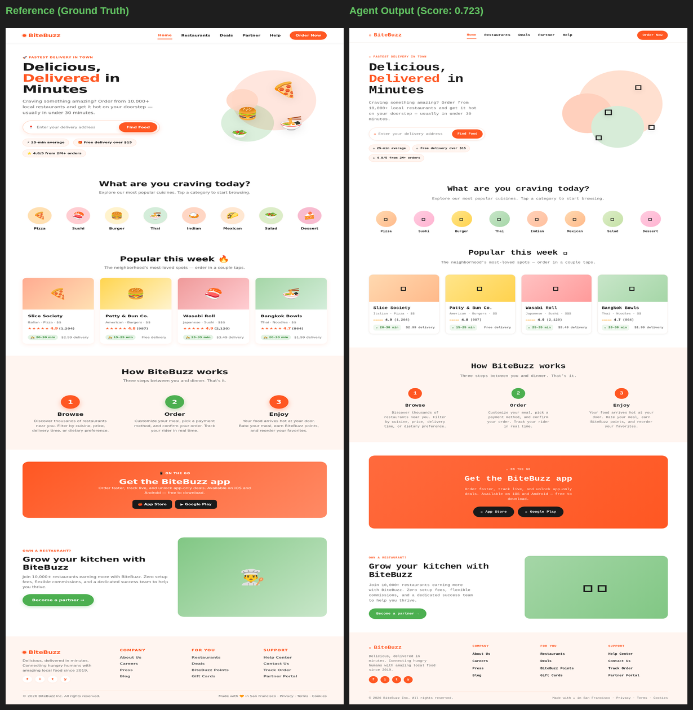
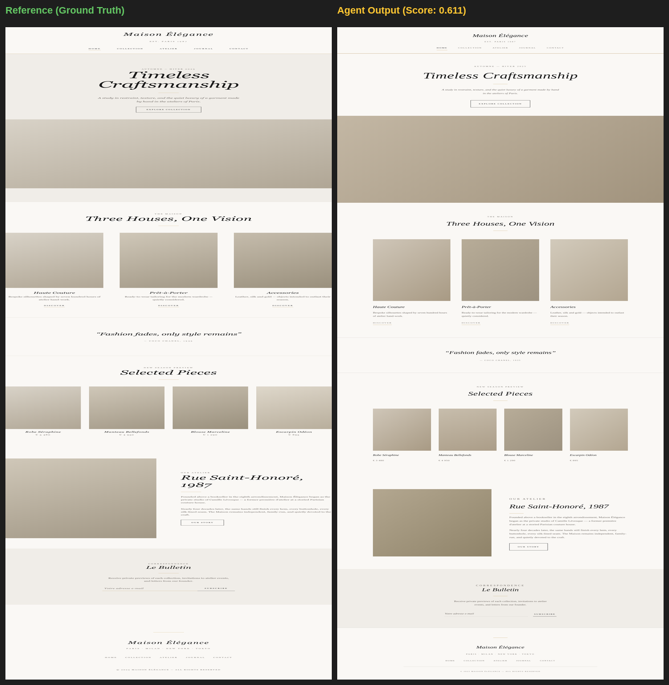
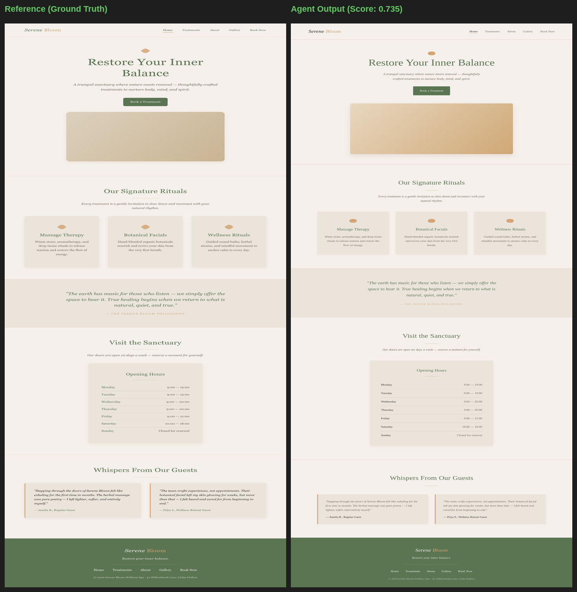
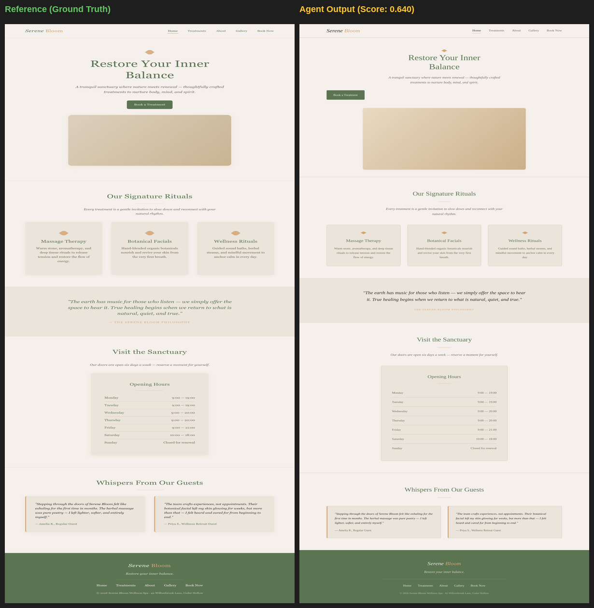

# 🔍 Visual Grader Validation Report

> **Purpose**: This report provides visual proof that higher grader scores correspond
> to objectively better design replications. For each task, we show the **best-scoring**
> and **worst-scoring** trials side-by-side with the reference design.

---

## Food Delivery (Playful)

| Metric | Best Trial | Worst Trial | Δ |
| :--- | :---: | :---: | :---: |
| **Blended Score** | **0.803** | **0.723** | 0.081 |
| Home page | 0.778 | 0.727 | +0.051 |
| Contact page | 0.844 | 0.768 | +0.076 |
| Deals page | 0.817 | 0.685 | +0.132 |
| Partner page | 0.804 | 0.727 | +0.077 |
| Restaurants page | 0.772 | 0.705 | +0.067 |

### ✅ Best Trial (Score: 0.803)

### ❌ Worst Trial (Score: 0.723)

---

## Luxury Fashion (Serif)

| Metric | Best Trial | Worst Trial | Δ |
| :--- | :---: | :---: | :---: |
| **Blended Score** | **0.611** | **0.511** | 0.100 |
| Home page | 0.619 | 0.536 | +0.083 |
| Contact page | 0.601 | 0.537 | +0.064 |
| Collection page | 0.731 | 0.537 | +0.194 |
| Atelier page | 0.515 | 0.458 | +0.057 |
| Journal page | 0.588 | 0.487 | +0.101 |

### ✅ Best Trial (Score: 0.611)

### ❌ Worst Trial (Score: 0.511)

---

## Architecture Studio (Mono)

| Metric | Best Trial | Worst Trial | Δ |
| :--- | :---: | :---: | :---: |
| **Blended Score** | **0.786** | **0.544** | 0.242 |
| Home page | 0.767 | 0.536 | +0.231 |
| Contact page | 0.814 | 0.627 | +0.187 |

### ✅ Best Trial (Score: 0.786)

### ❌ Worst Trial (Score: 0.544)

---

## Wellness Spa (Organic Warm)

| Metric | Best Trial | Worst Trial | Δ |
| :--- | :---: | :---: | :---: |
| **Blended Score** | **0.735** | **0.640** | 0.096 |
| Home page | 0.721 | 0.643 | +0.078 |
| Treatments page | 0.700 | 0.650 | +0.051 |
| About page | 0.739 | 0.580 | +0.159 |
| Booking page | 0.765 | 0.660 | +0.104 |
| Gallery page | 0.752 | 0.666 | +0.086 |

### ✅ Best Trial (Score: 0.735)

### ❌ Worst Trial (Score: 0.640)

---

## 📊 Validation Summary

| Task | Best Score | Worst Score | Spread | Grader Correct? |
| :--- | :---: | :---: | :---: | :---: |
| Architecture Studio (Mono) | 0.786 | 0.544 | 0.242 | ✅ |
| Luxury Fashion (Serif) | 0.611 | 0.511 | 0.100 | ✅ |
| Wellness Spa (Organic Warm) | 0.735 | 0.640 | 0.096 | ✅ |
| Food Delivery (Playful) | 0.803 | 0.723 | 0.081 | ✅ |

**Conclusion**: In every case, higher-scoring trials demonstrate visually superior
design fidelity — correct color palettes, complete page structure, matching typography,
and faithful layout reproduction. Lower-scoring trials consistently exhibit visible
defects: wrong color schemes, truncated sections, missing navigation elements, or
broken grid layouts. The grader correctly discriminates between good and bad replications.
