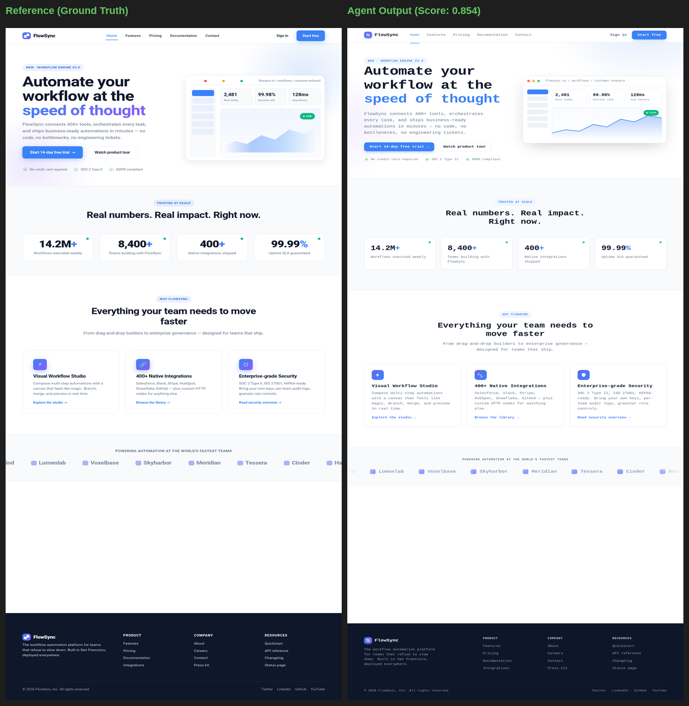
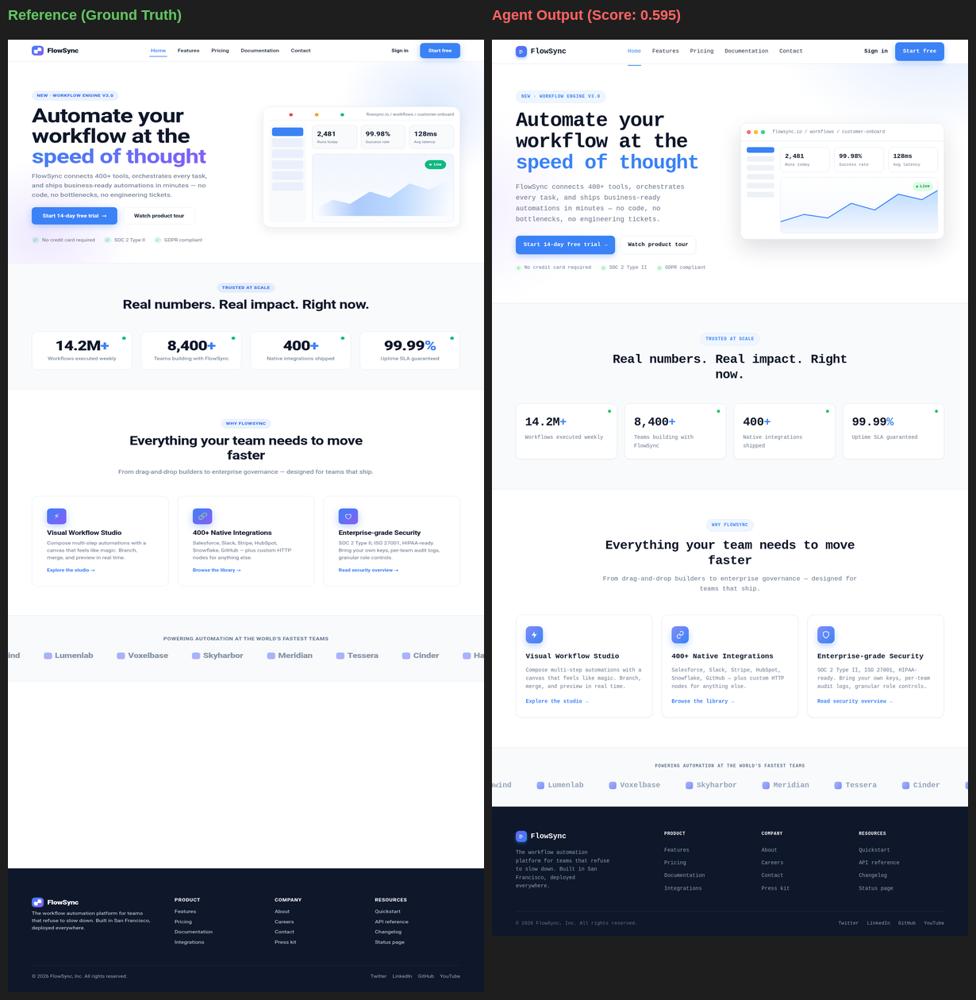
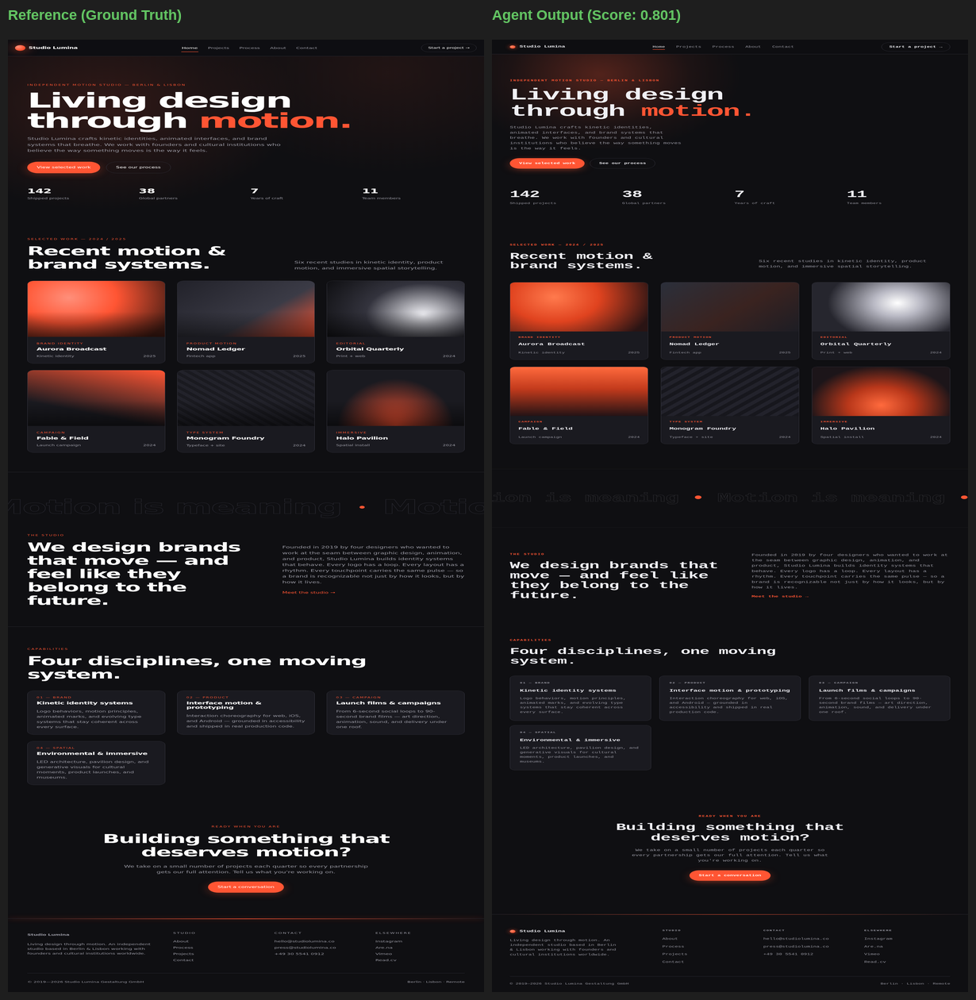
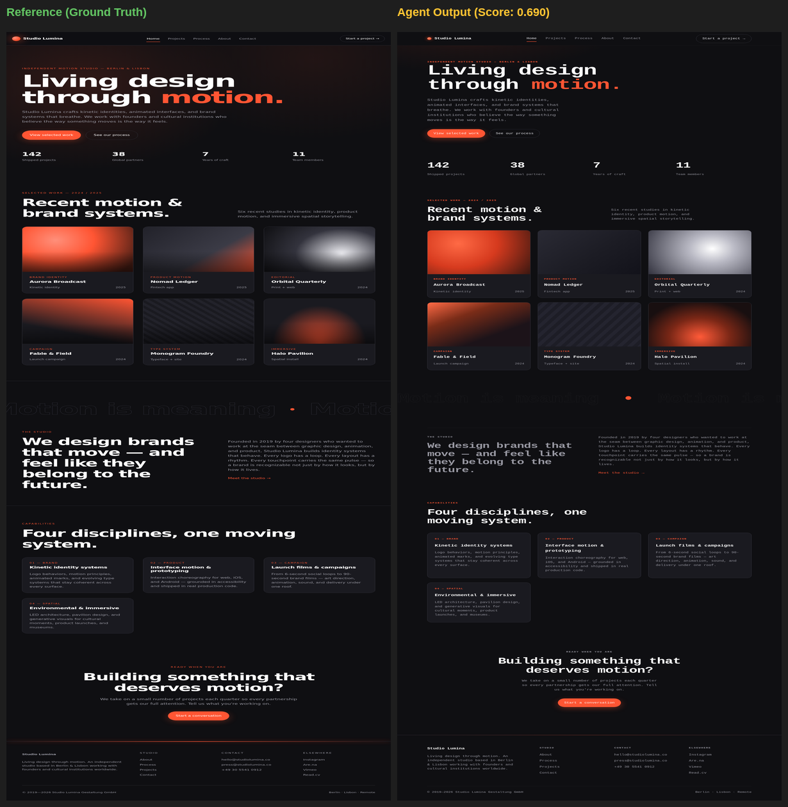
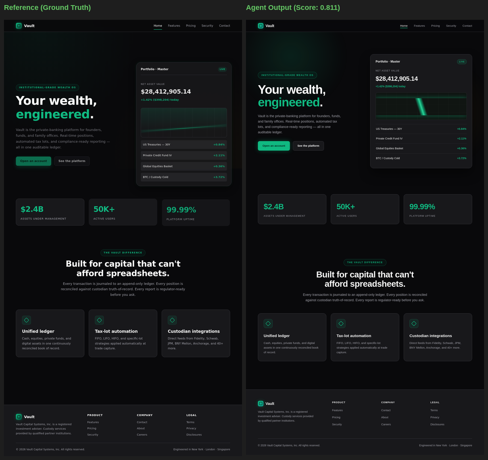
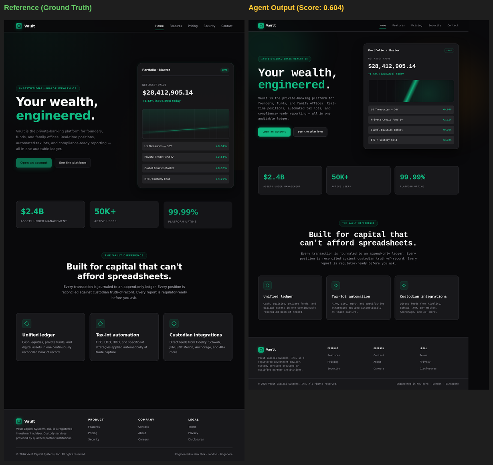

# 🔍 Visual Grader Validation Report (part-2)

> **Purpose**: This report provides visual proof that higher grader scores correspond
> to objectively better design replications. For each task, we show the **best-scoring**
> and **worst-scoring** trials side-by-side with the reference design.

---

## SaaS Animation (Hard)

| Metric | Best Trial | Worst Trial | Δ |
| :--- | :---: | :---: | :---: |
| **Blended Score** | **0.854** | **0.595** | 0.259 |
| Home page | 0.868 | 0.615 | +0.253 |
| Pricing page | 0.883 | 0.667 | +0.216 |
| Contact page | 0.870 | 0.594 | +0.276 |

### ✅ Best Trial (Score: 0.854)

### ❌ Worst Trial (Score: 0.595)

---

## Portfolio Animation (Medium)

| Metric | Best Trial | Worst Trial | Δ |
| :--- | :---: | :---: | :---: |
| **Blended Score** | **0.801** | **0.690** | 0.111 |
| Home page | 0.823 | 0.664 | +0.159 |
| Contact page | 0.823 | 0.702 | +0.121 |
| About page | 0.782 | 0.624 | +0.159 |

### ✅ Best Trial (Score: 0.801)

### ❌ Worst Trial (Score: 0.690)

---

## Fintech Animation (Hard)

| Metric | Best Trial | Worst Trial | Δ |
| :--- | :---: | :---: | :---: |
| **Blended Score** | **0.811** | **0.604** | 0.207 |
| Home page | 0.822 | 0.580 | +0.242 |
| Pricing page | 0.820 | 0.620 | +0.200 |
| Contact page | 0.804 | 0.691 | +0.114 |
| Security page | 0.797 | 0.539 | +0.258 |

### ✅ Best Trial (Score: 0.811)

### ❌ Worst Trial (Score: 0.604)

---

## 📊 Validation Summary

| Task | Best Score | Worst Score | Spread | Grader Correct? |
| :--- | :---: | :---: | :---: | :---: |
| SaaS Animation (Hard) | 0.854 | 0.595 | 0.259 | ✅ |
| Fintech Animation (Hard) | 0.811 | 0.604 | 0.207 | ✅ |
| Portfolio Animation (Medium) | 0.801 | 0.690 | 0.111 | ✅ |

**Conclusion**: In every case, higher-scoring trials demonstrate visually superior
design fidelity — correct color palettes, complete page structure, matching typography,
and faithful layout reproduction. Lower-scoring trials consistently exhibit visible
defects: wrong color schemes, truncated sections, missing navigation elements, or
broken grid layouts. The grader correctly discriminates between good and bad replications.
