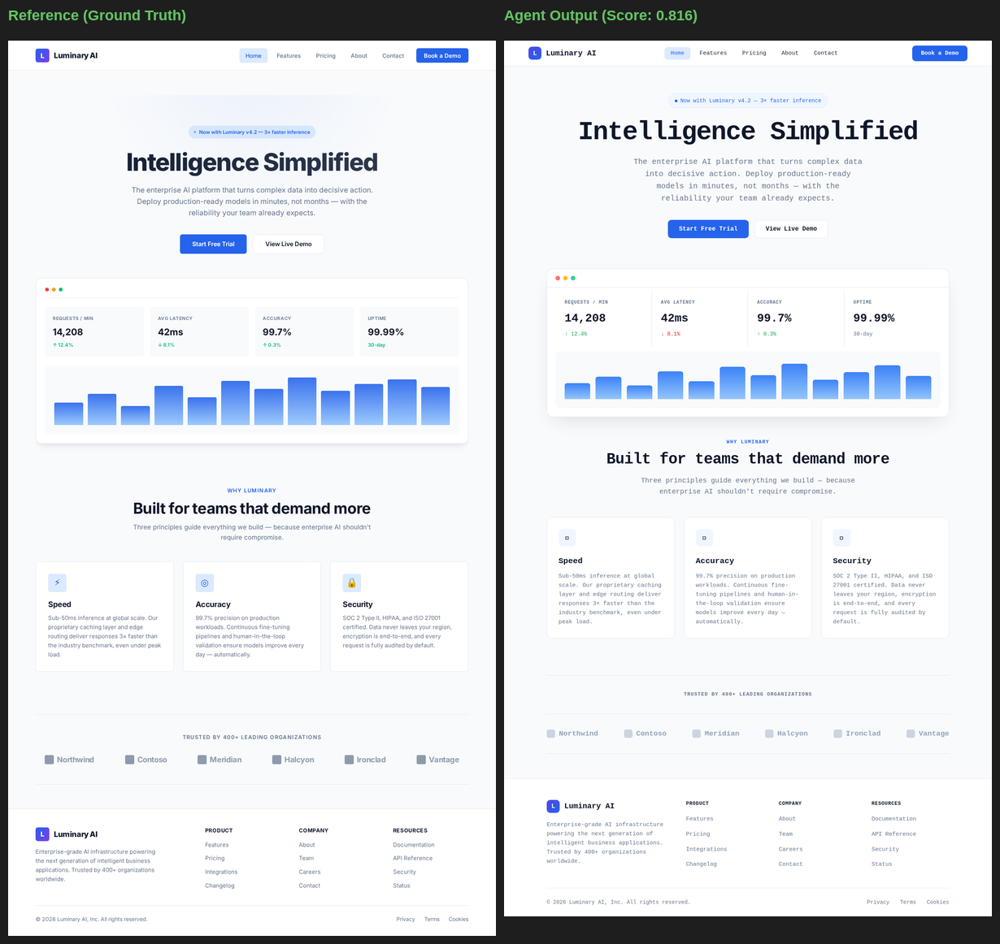
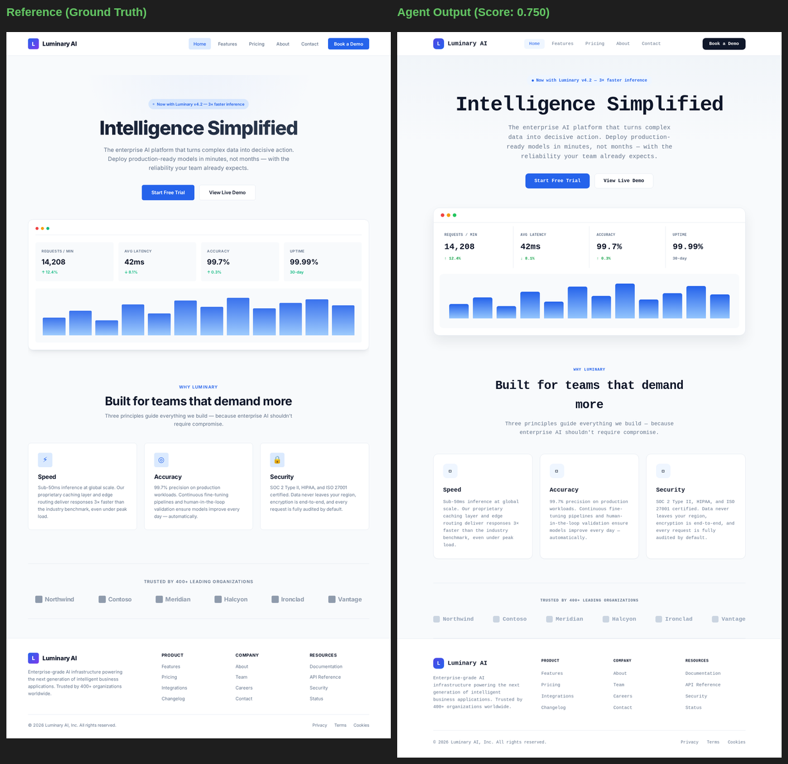
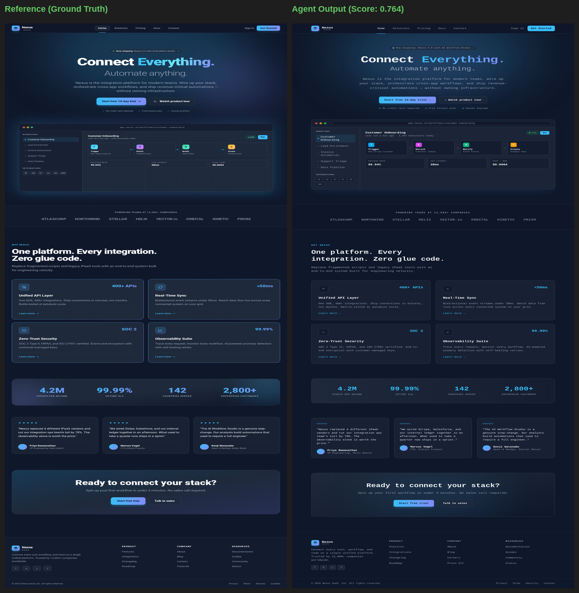
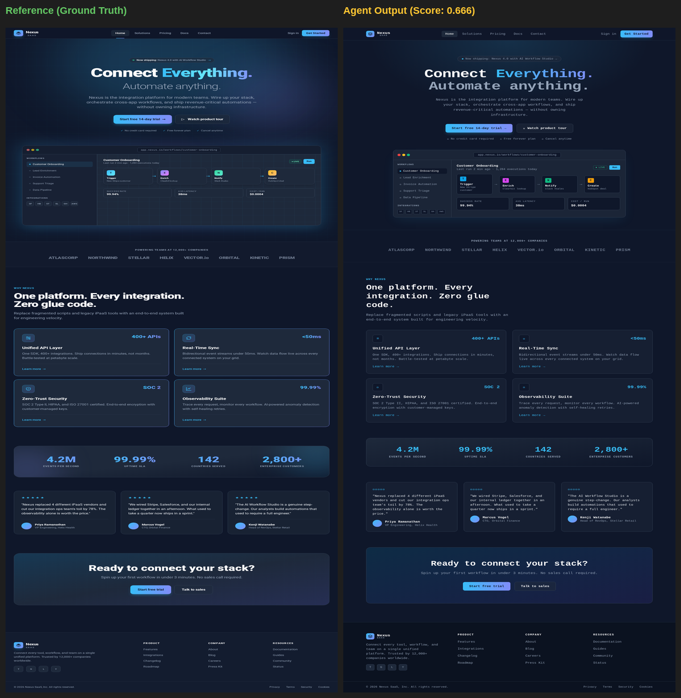
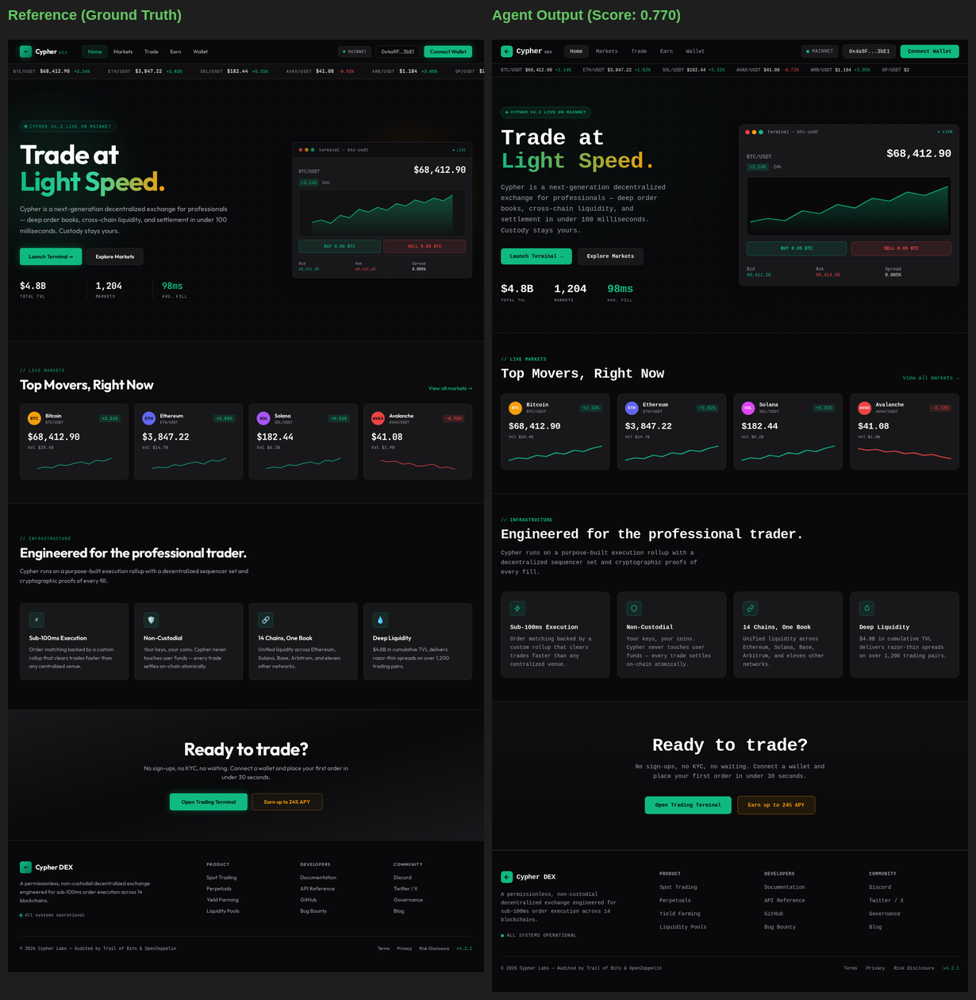
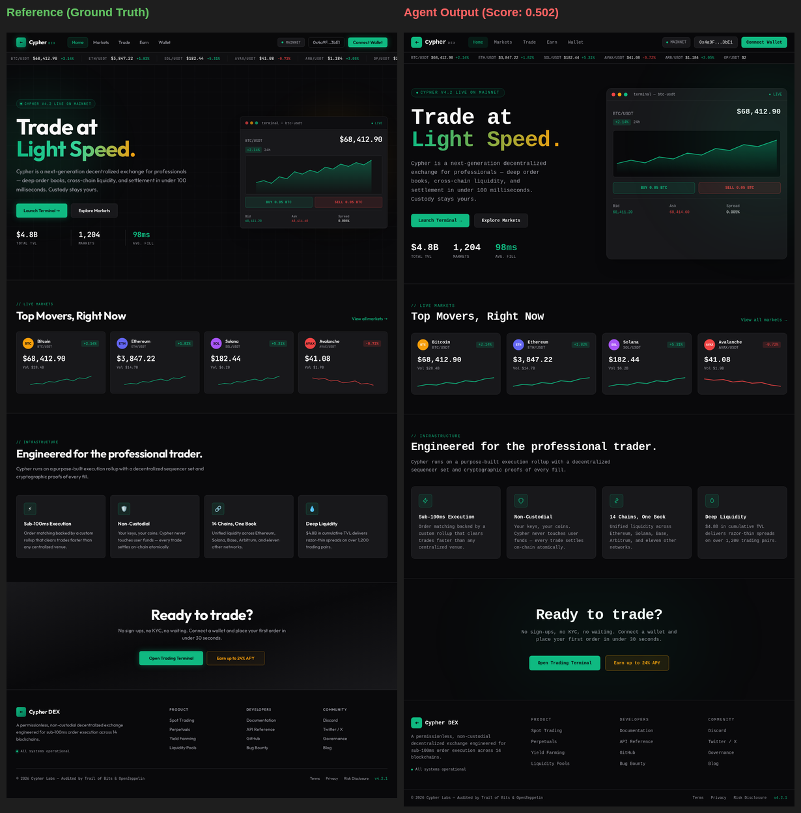

# 🔍 Visual Grader Validation Report (part-3)

> **Purpose**: This report provides visual proof that higher grader scores correspond
> to objectively better design replications. For each task, we show the **best-scoring**
> and **worst-scoring** trials side-by-side with the reference design.

---

## React JS + Vanilla CSS (Easy)

| Metric | Best Trial | Worst Trial | Δ |
| :--- | :---: | :---: | :---: |
| **Blended Score** | **0.816** | **0.750** | 0.066 |
| Home page | 0.863 | 0.825 | +0.038 |
| Pricing page | 0.805 | 0.730 | +0.076 |
| Contact page | 0.807 | 0.697 | +0.110 |
| About page | 0.832 | 0.817 | +0.015 |

### ✅ Best Trial (Score: 0.816)

### ❌ Worst Trial (Score: 0.750)

---

## React JS + Tailwind CSS (Medium)

| Metric | Best Trial | Worst Trial | Δ |
| :--- | :---: | :---: | :---: |
| **Blended Score** | **0.764** | **0.666** | 0.099 |
| Home page | 0.703 | 0.581 | +0.121 |
| Solutions page | 0.815 | 0.669 | +0.146 |
| Pricing page | 0.781 | 0.670 | +0.110 |
| Contact page | 0.708 | 0.676 | +0.032 |

### ✅ Best Trial (Score: 0.764)

### ❌ Worst Trial (Score: 0.666)

---

## Solid JS + Tailwind CSS (Hard)

| Metric | Best Trial | Worst Trial | Δ |
| :--- | :---: | :---: | :---: |
| **Blended Score** | **0.770** | **0.502** | 0.268 |
| Home page | 0.799 | 0.792 | +0.007 |
| Markets page | 0.805 | 0.472 | +0.332 |

### ✅ Best Trial (Score: 0.770)

### ❌ Worst Trial (Score: 0.502)

---

## 📊 Validation Summary

| Task | Best Score | Worst Score | Spread | Grader Correct? |
| :--- | :---: | :---: | :---: | :---: |
| Solid JS + Tailwind CSS (Hard) | 0.770 | 0.502 | 0.268 | ✅ |
| React JS + Tailwind CSS (Medium) | 0.764 | 0.666 | 0.099 | ✅ |
| React JS + Vanilla CSS (Easy) | 0.816 | 0.750 | 0.066 | ✅ |

**Conclusion**: In every case, higher-scoring trials demonstrate visually superior
design fidelity — correct color palettes, complete page structure, matching typography,
and faithful layout reproduction. Lower-scoring trials consistently exhibit visible
defects: wrong color schemes, truncated sections, missing navigation elements, or
broken grid layouts. The grader correctly discriminates between good and bad replications.
