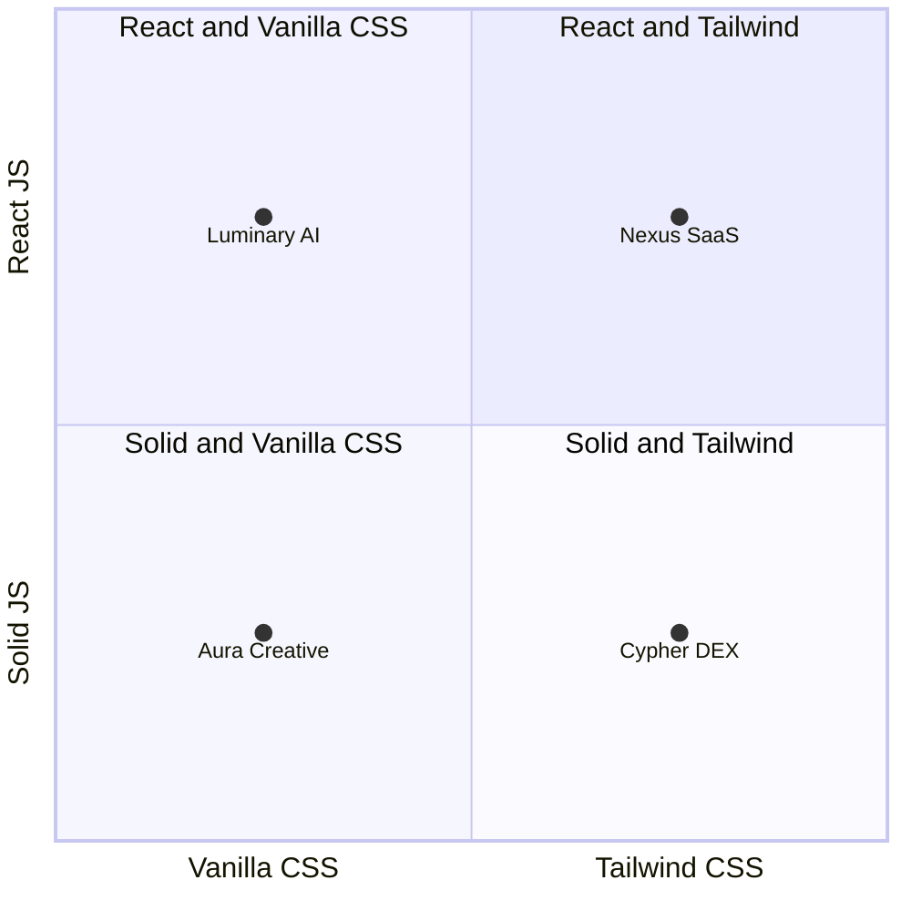
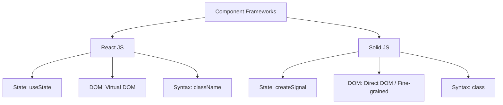

# Part 3: Multi-Framework Architecture & SPA Verification (v3)

This document details the architectural design decisions, grading mechanics, and multi-framework execution pipelines implemented for **Part 3 (Multi-Framework Single Page Applications)** across `web-design-bench`.

> **Empirical Benchmark Results & Statistical Charts**: For full quantitative scores, `Pass@1` statistics, statistical variance box plots, and exact performance breakdowns across all Part 3 multi-framework SPAs, refer directly to **[Section 3 in the Master Evaluation Report](evaluation_report.md#part-3-multi-framework-benchmark-results--architectural-analysis-v3)**.

---

## 1. The 2×2 Evaluation Matrix

To rigorously assess AI coding agents beyond basic HTML/CSS files, Part 3 introduces a multi-dimensional matrix comparing two leading modern component frameworks alongside two contrasting styling paradigms:

---

## 2. Framework Navigation & SPA Rendering Architecture

Evaluating multi-page Single Page Applications (`Vite + React/Solid`) inside an isolated verification container requires distinct execution choreography compared to static multi-file HTML packages:

### a. Automated Build Verification (`_validate_files_tool`)
Unlike static HTML evaluations where browser instances open local files directly (`file:///app/index.html`), multi-framework tasks require compilation before rendering. Our validation and grading pipeline:
1. Verifies structural package composition (`package.json`, `vite.config.js` or `.ts`).
2. Executes a containerized package build sequence (`npm run build`) via NodeJS inside our customized runtime.
3. Targets the compiled bundled structure (`dist/`) directly when running headless chromium capture procedures.

### b. In-Memory Tab Switching via Playwright (`render.py`)
Because SPAs manage multi-view navigation without full browser page reloads, each task instruction specifies explicit semantic element IDs corresponding to logical tabs (`id="nav-page_home"`, `id="nav-page_features"`). 

Our automated headless browser (`recipe/render.py`) simulates interactive human navigation by locating and clicking each specific navigation button ID (`#nav-<tab_key>`), allowing custom transitions and virtual DOM updates to complete before snapping high-resolution PNG evaluations across each requested viewport.

---

## 3. Deep-Dive: Framework & Styling Trade-offs

### ⚛️ React JS vs. ⚡ Solid JS

* **React JS**: Evaluates the agent's mastery of widely distributed virtual DOM conventions, functional reactivity, and component decoupling (`useState`, `useEffect`, and standard `className` declarations).
* **Solid JS**: Serves as a definitive test of targeted instruction-following capability. Solid JS differs heavily from standard React idioms (`createSignal`, explicit function invocations for getters such as `activeTab() === 'home'`, and standard HTML `class` attribute syntax inside JSX).

---

### 🎨 Vanilla CSS vs. 💨 Tailwind CSS Utility Scales

* **The Tailwind Approximation Gap**: While Tailwind CSS simplifies developer workflows via high-velocity utility scaling (`p-4`, `text-xl`, `space-y-6`), it mathematically quantizes exact visual padding, color stops, and layout geometries into rigid pre-defined bucket steps (`1rem`, `1.25rem`, etc.). When evaluating structural image alignment against exact reference designs (`SSIM` + `pHash`), the agent's forced quantization slightly compresses total structural accuracy compared to unconstrained exact CSS.
* **Vanilla CSS Micro-Tuning**: Using standard global stylesheets (`src/index.css` with CSS variables), agents can directly declare precise fractional design dimensions (`padding: 18px 24px; font-size: 27px;`), yielding higher overall visual similarity alignment.

---

## 4. Key Failure Modes & Edge Cases

1. **Complex Tailwind Gradient Approximations**: Multi-stop radial gradients (`bg-gradient-to-tr from-purple-900/40 via-transparent to-blue-900/30`) or overlapping blurred backdrop filters (`filter blur-3xl`) are frequently over-simplified by models into solid color blocks (`bg-slate-950`), impacting Color Histogram correlation.
2. **Reversed Framework Idioms**: When building fine-grained Solid JS codebases without proper technical prompting guardrails, models occasionally hallucinate React equivalents (`useState` or passing signal getters as uncalled properties inside JSX logic conditionals). Our instruction templates explicitly isolate these framework guardrails inside `prompt.py` to preserve near-perfect compilation adherence.

---

## 4. Conclusion & Recommendations

The Part 3 evaluation conclusively demonstrates that **Claude Code (Opus 4.7)** is a highly capable multi-framework web developer. It successfully navigates the nuances of Vite scaffolding, Solid JS reactivity, and Tailwind CSS configuration without human intervention.

### 💡 Recommendations for Benchmark Users
a. **Prefer Vanilla CSS for Pixel-Perfect Replication**: If your evaluation prioritizes exact visual cloning (SSIM/pHash), Vanilla CSS allows agents to micro-tune pixel dimensions more effectively than Tailwind's utility scales.

b. **Leverage Vite + Playwright SPA Navigation**: The successful execution of this suite validates our automated SPA tab-clicking architecture in `render.py`, establishing a robust foundation for evaluating complex interactive web applications beyond static HTML.

---

## 📚 Documentation Navigation

Explore the complete documentation suite to understand the full lifecycle of `web-design-bench`:
* **[Main README & Quick-Start](../README.md)**: Repository overview, architecture diagrams, and execution instructions.
* **[Design Decisions & Trade-offs](design_decisions.md)**: Architectural thought process, grader mechanics, and framework integrations.
* **[Evaluation Report & Model Behavior](evaluation_report.md)**: Comprehensive analysis of the 100-trial benchmark run, `Pass@K` metrics, and deep dives into AI model failure patterns.
* **[Visual Grader Validation](grader_validation/grader_validation.md)**: Side-by-side reference vs. agent screenshot comparisons proving higher scores = better designs.
* **[Part 2: Animations & Temporal State Freezing](part2_animations.md)**: Architecture for grading CSS animations via Playwright frame freezing (`t0`, `t500`, `t1200`) and WebM video generation.
* **[Part 3: Multi-Framework Benchmark Report](part3_frameworks.md)**: Architectural and empirical analysis of the 2×2 framework matrix (React vs. Solid JS, Vanilla vs. Tailwind CSS).

