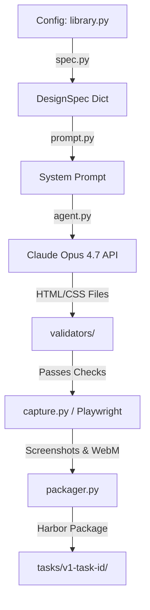

# 🛠️ `recipe/` — Automated Task Generation Pipeline

This directory contains the automated task synthesis pipeline for `web-design-bench`. It is responsible for programmatically generating high-fidelity, multi-page website replication tasks from structured design specifications using Claude Opus 4.7, validating them for safety and structural completeness, capturing reference screenshots/videos via Playwright, and packaging them into self-contained Harbor task environments.

---

## 📂 Directory Layout & File Roles

```markdown
recipe/
├── generate.py             # Main CLI entry point for at-scale task synthesis
├── spec.py                 # Constructs structured DesignSpec dictionaries from configs
├── prompt.py               # Renders system prompts & design instructions for Claude
├── agent.py                # Handles Anthropic API communication & file extraction
├── capture.py              # Playwright orchestration for screenshots, videos, & frame freezing
├── packager.py             # Assembles generated assets into Harbor task directories
├── configs/                # Website archetype definitions (18 unique configs: 10 v1 + 4 v2 + 4 v3)
│   ├── __init__.py         # Config registry decorator & loader
│   └── library.py          # 10 Static (v1), 4 Animation (v2), and 4 Framework (v3) configs
└── validators/             # Safety & structural integrity checks
    ├── __init__.py         # Combined validation runner (`validate_all`)
    ├── javascript.py       # Enforces No-JS policy (forbids <script>, .js, onclick)
    ├── structure.py        # Verifies all required HTML pages & style.css exist
    └── complexity.py       # Ensures generated CSS meets minimum visual richness rules
```

---

## 🚀 CLI Usage & Examples

### 1. List Available Archetype Configurations
To view all 18 registered website configurations (10 Static `v1`, 4 Animation `v2`, 4 Framework `v3`) along with their difficulty tiers and archetypes:
```bash
uv run python -m recipe.generate --list
```

### 2. Generate a New Task from Scratch
To synthesize a brand new task using Claude Opus 4.7 (requires `ANTHROPIC_API_KEY`):
```bash
export ANTHROPIC_API_KEY="sk-ant-..."
uv run python -m recipe.generate --config ai_startup_neon_hard --seed 42
```
*This will generate the website, run validators, capture screenshots, and output the final package to `tasks/v1-aistartupneonhardconfig-73475c`.*

### 3. Regenerate Screenshots for an Existing Solution
If you have already generated the HTML/CSS solution and want to re-run the Playwright screenshot/video capture step without calling the Anthropic API:
```bash
uv run python -m recipe.generate --config saas_animation_hard --solution-dir tasks/v2-saasanimationhardconfig-73475c/solution
```

---

## ⚙️ Architecture & Data Flow



1. **Specification (`spec.py`)**: Reads class attributes from `configs/library.py` and builds a standardized `DesignSpec`.
2. **Generation (`agent.py`)**: Calls Claude Opus 4.7 to generate 5 HTML pages + `style.css` in a single pass.
3. **Validation (`validators/`)**: Ensures zero JavaScript is present, all files exist, and CSS contains sufficient styling rules.
4. **Capture (`capture.py`)**: Uses Playwright to render the pages, capture full-page screenshots, record 3-second WebM videos, and freeze animation frames (`t0`, `t500`, `t1200`, `t1800`).
5. **Packaging (`packager.py`)**: Generates `task.toml`, `instruction.md`, and `pages.json`, assembling the final Harbor task directory in `tasks/`.
